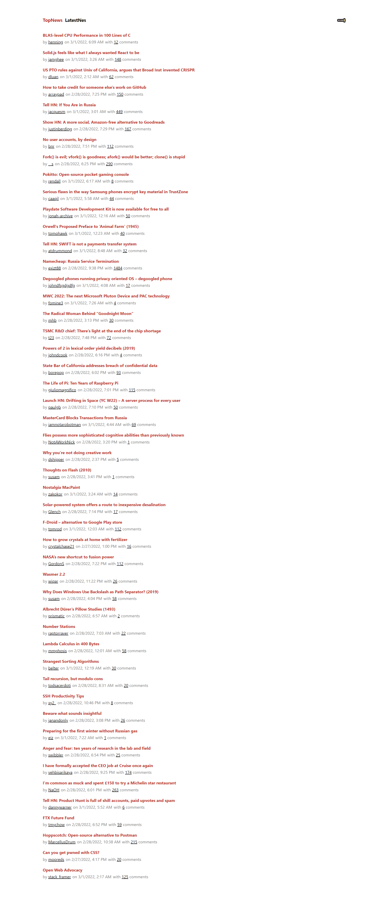
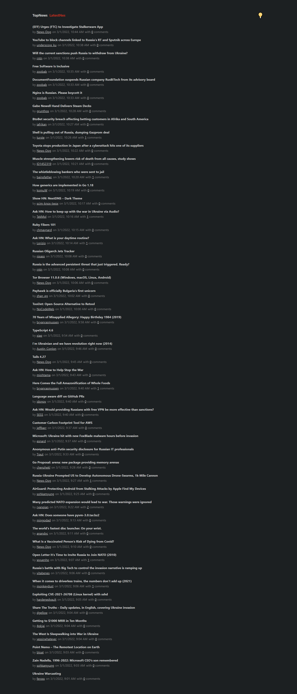
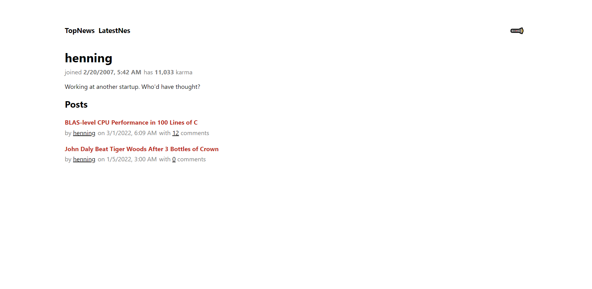
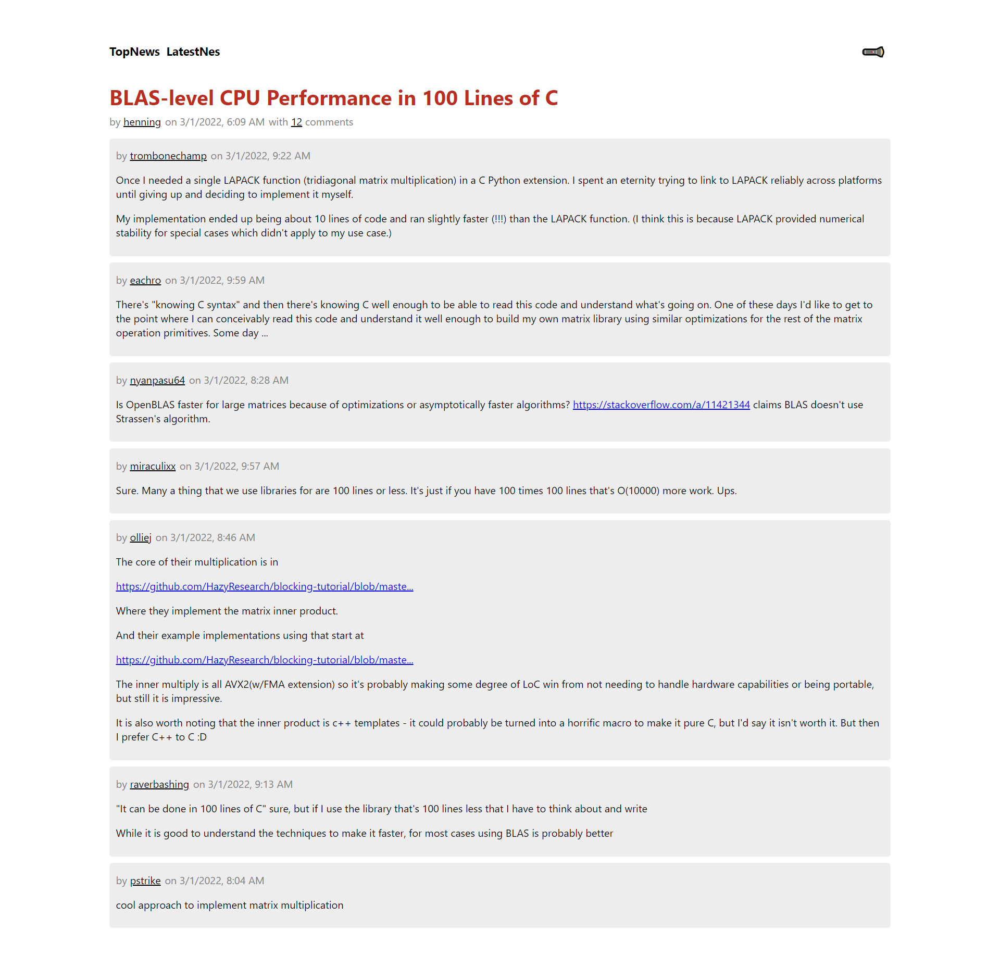

# Project Preview
A Hacker News Clone using React and TypeScript

## Available Scripts

we can run start the project using the following command,
#### `npm start` or `yarn start`

Runs the app in the development mode. 
Open [http://localhost:8080](http://localhost:8080) to view it in the browser.

# Functionality of the Apps:

### Home Page in Light Mode

### Home Page in Dark Mode

### All the posts by a user

### All the comments of a post

